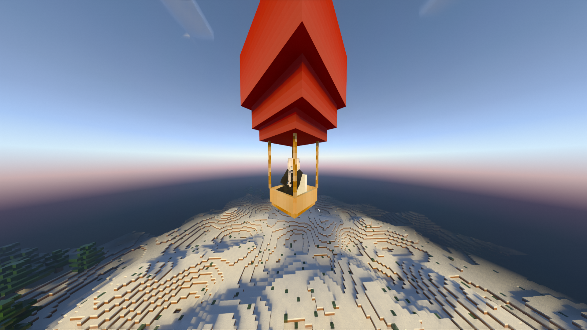

# HotAirBalloon
A manoeuvrable hot air balloon for PMMP 4.0. <a href="https://poggit.pmmp.io/ci/jojoe77777/FormAPI/~/">FormAPI</a> is required for the plugin to work.

# :question: How to use?
By using the <b>"/balloon"</b> command you can make your hot air balloon appear or disappear.
To manoeuvre it, use the "WASD" keys. To get out of the hot air balloon you can either jump or crouch down.

  

# :bug: Known bugs
<ul>
  <li>The diagonal movement is inverted.</li>
</ul>

# :eyes: About
If you have any problems or want to contact me, you can do it through discord: <b>Millie#5082</b>

I don't plan to give deep support to the plugin, but any suggestions are welcome.
